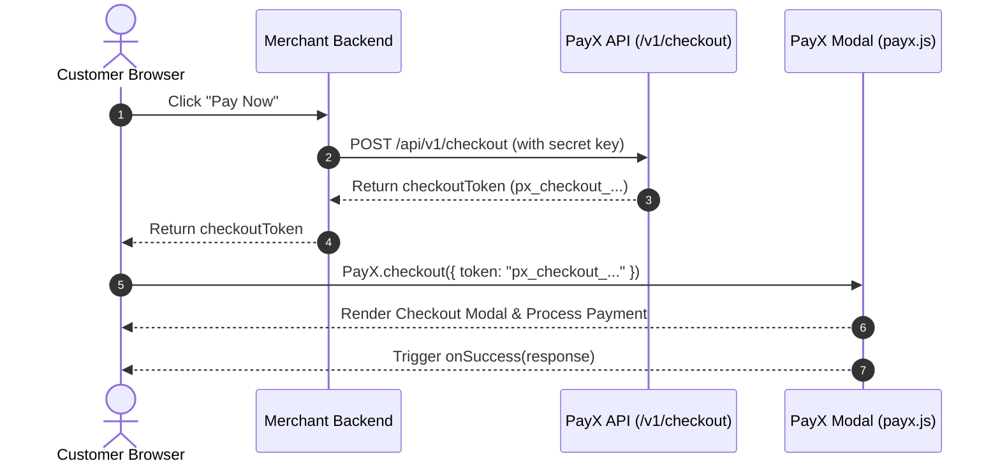

The `payx-js` SDK allows you to accept payments directly on your website using a secure, modal checkout experience without redirecting your customers.

## How It Works (Scoped Token Model)

To protect your account, **never embed secret API keys in client-side code**. PayX uses a secure 2-step token flow:

1. **Server-Side Token Generation:** Your backend server calls `POST /api/v1/checkout` using your secret API key (`px_live_v2_...` or `px_test_v2_...`) to create a 30-minute scoped checkout token (`px_checkout_...`).
2. **Client-Side Initialization:** Your frontend receives the scoped token and initializes `PayX.checkout({ token })` to render the payment modal.



---

## Installation

### Via CDN (Recommended)

Include the PayX JS script tag before the closing `</body>` tag or in the `<head>` of your page:

```html
<script src="https://payx.company/sdk/payx.js"></script>
```

### Via NPM

```bash
npm install payx-js@latest
```

---

## Usage Example

### Step 1: Generate Scoped Token on Backend (Node.js)

```javascript
// Express.js backend endpoint
app.post('/api/create-checkout-session', async (req, res) => {
  const response = await fetch('https://payx.company/api/v1/checkout', {
    method: 'POST',
    headers: {
      'x-api-key': process.env.PAYX_SECRET_KEY, // px_live_v2_... or px_test_v2_...
      'Content-Type': 'application/json'
    },
    body: JSON.stringify({
      amount: 100.00,
      currency: 'GHS',
      email: req.body.email
    })
  });

  const data = await response.json();
  res.json({ checkoutToken: data.checkoutToken });
});
```

### Step 2: Launch Checkout in Frontend

```html
<!DOCTYPE html>
<html lang="en">
<head>
  <meta charset="UTF-8">
  <title>PayX Checkout Example</title>
</head>
<body>
  <button id="pay-button">Pay GHS 100.00</button>

  <script src="https://payx.company/sdk/payx.js"></script>
  <script>
    document.getElementById('pay-button').addEventListener('click', async () => {
      // 1. Fetch scoped checkout token from your backend
      const res = await fetch('/api/create-checkout-session', {
        method: 'POST',
        headers: { 'Content-Type': 'application/json' },
        body: JSON.stringify({ email: 'customer@example.com' })
      });
      const { checkoutToken } = await res.json();

      // 2. Open PayX Checkout Modal
      PayX.checkout({
        token: checkoutToken,
        onSuccess: function(response) {
          console.log("Payment successful! Reference:", response.reference);
          alert("Payment complete! Reference: " + response.reference);
        },
        onClose: function() {
          console.log("Customer closed the checkout modal.");
        },
        onError: function(error) {
          console.error("Payment error:", error);
        }
      });
    });
  </script>
</body>
</html>
```

---

## Configuration Options

<ParamField body="token" type="string" required>
  The 30-minute scoped checkout token (`px_checkout_...`) generated server-side by `POST /api/v1/checkout`.
</ParamField>

## Callbacks

<ParamField body="onSuccess" type="function" required>
  Callback triggered when the transaction is completed successfully. Receives a response object containing `reference` and transaction metadata.
</ParamField>

<ParamField body="onClose" type="function">
  Callback triggered when the customer dismisses or closes the modal without completing payment.
</ParamField>

<ParamField body="onError" type="function">
  Callback triggered if an unexpected error occurs during initialization or processing.
</ParamField>

---

<Warning>
  **Security Rule:** Never pass your `px_live_v2_...` or `px_test_v2_...` secret API keys into `PayX.checkout()`. Only pass short-lived scoped tokens (`px_checkout_...`).
</Warning>
